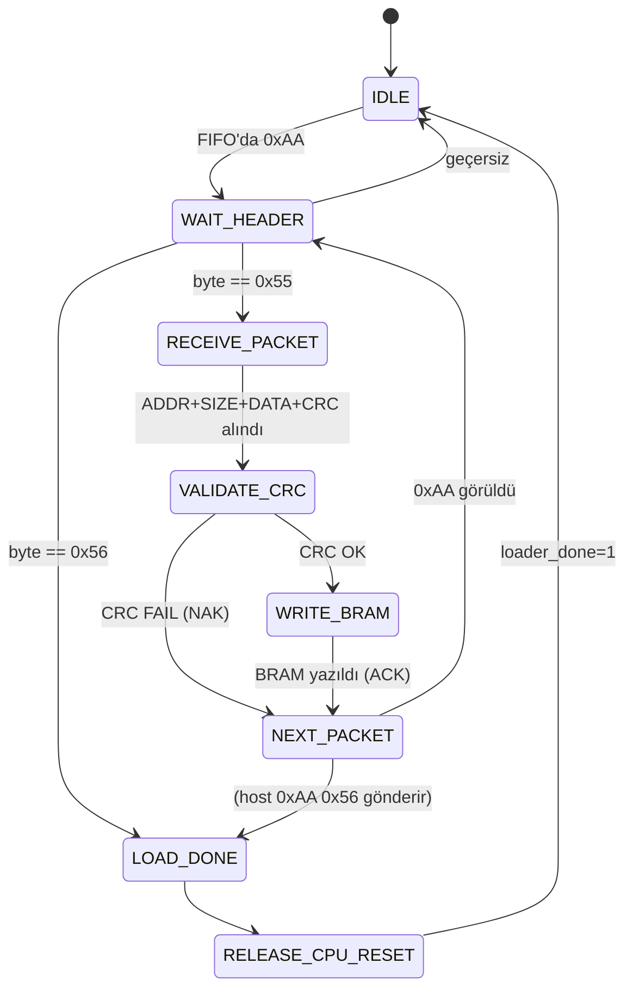

# FPGA UART Loader Sistemi — Teknik Dokümantasyon

## 1. Sistem Mimarisi

RVI projesi, kaynak koddan FPGA üzerinde çalışan programa kadar tam bir pipeline sunar:

```
┌─────────────┐    ┌─────────────┐    ┌──────────────────┐    ┌─────────────┐
│  .asm       │───▶│  Assembler  │───▶│  .o (JSON)       │───▶│  Linker     │
│  kaynak     │    │  (rvi.py)   │    │  nesne dosyası   │    │  linker.py  │
└─────────────┘    └─────────────┘    └──────────────────┘    └──────┬──────┘
                                                                        │
                                                                        ▼
┌─────────────┐    ┌─────────────┐    ┌──────────────────┐    ┌─────────────────┐
│  PicoRV32   │◀───│  BRAM       │◀───│  loader_fsm      │◀───│  host_uploader  │
│  CPU        │    │  4 KB       │    │  + uart_rx       │    │  .py (pyserial) │
└─────────────┘    └─────────────┘    └──────────────────┘    └────────▲────────┘
       │                                      ▲                          │
       │                                      │ UART 115200                │
       ▼                                      └──────────────────────────┘
  LED @ 0x2000 (3 adet, active-low)                                  .hex / .o
```

### Modül hiyerarşisi (FPGA)

| Modül | Dosya | Görev |
|--------|--------|--------|
| `top` | `top.v` | Entegrasyon |
| `uart_rx` | `uart_rx.v` | 8N1 alıcı + 256 bayt FIFO |
| `uart_tx` | `uart_tx.v` | ACK/NAK yanıtları |
| `loader_fsm` | `loader_fsm.v` | Paket decode, CRC, BRAM yazma FSM |
| `bram_interface` | `bram_interface.v` | CPU + loader çift port BRAM |
| `cpu_control` | `cpu_control.v` | `cpu_resetn`, entry PC |
| `crc32_byte` | `crc32_byte.v` | IEEE CRC-32 bayt işlemcisi |
| `picorv32` | `picorv32.v` | RV32I çekirdek |

---

## 2. Loader FSM — Durum Diyagramı



### Durum açıklamaları

| Durum | Davranış |
|--------|-----------|
| **IDLE** | CPU reset'te; UART'ta `0xAA` beklenir |
| **WAIT_HEADER** | `0x55` → paket; `0x56` → yükleme bitti |
| **RECEIVE_PACKET** | ADDR(4) + SIZE(2) + DATA(n) + CRC(4) alınır |
| **VALIDATE_CRC** | CRC-32 karşılaştırılır |
| **WRITE_BRAM** | Bayt adresli BRAM yazımı |
| **NEXT_PACKET** | ACK gönderilir; sonraki paket beklenir |
| **LOAD_DONE** | Oturum kapandı |
| **RELEASE_CPU_RESET** | `loader_done` → CPU serbest |

---

## 3. UART Paket Formatı

### Oturum başlangıcı (her paket öncesi)

| Bayt | Değer | Anlam |
|------|--------|--------|
| 0 | `0xAA` | Senkron 1 |
| 1 | `0x55` | Senkron 2 / paket başı |

### Paket gövdesi

| Alan | Boyut | Endian | Açıklama |
|------|--------|--------|----------|
| ADDRESS | 4 | LE | BRAM fiziksel adresi |
| SIZE | 2 | LE | DATA uzunluğu (0–256) |
| DATA | SIZE | — | Ham baytlar |
| CRC32 | 4 | LE | `CRC32(ADDRESS‖SIZE‖DATA)`, IEEE 802.3 |

CRC hesabı Python tarafında: `zlib.crc32(body) & 0xFFFFFFFF`

### Oturum sonu

| Bayt | Değer |
|------|--------|
| 0 | `0xAA` |
| 1 | `0x56` |

### FPGA → Host yanıtları

| Bayt | Anlam |
|------|--------|
| `0x06` | ACK — paket kabul |
| `0x15` | NAK — CRC hatası, host yeniden gönderir |

### UART parametreleri

- **Baud:** 115200 (varsayılan)
- **Çerçeve:** 8N1
- **Saat:** 27 MHz (Tang Nano 9K onboard osilatör, `CLK_FREQ` parametresi)

---

## 4. Bellek Haritası

| Adres aralığı | Boyut | Erişim |
|---------------|--------|--------|
| `0x0000_0000` – `0x0000_0FFF` | 4 KB | Program BRAM (loader + CPU) |
| `0x0000_2000` | 32 bit | LED MMIO (`sw` → `led_reg[2:0]`, pinler active-low) |
| Diğer | — | Okuma `0`, yazma yok sayılır |

### Linker (FPGA)

`link_fpga.ld` kullanın — veri BRAM içinde:

```
TEXT_BASE = 0x00000000
DATA_BASE = 0x00000400
```

Orijinal `link.ld` (`DATA_BASE = 0x10000`) masaüstü/sembol çözümleme için korunur; FPGA testlerinde `link_fpga.ld` tercih edilir.

### Stack

PicoRV32 `STACKADDR = 0xFFC` (BRAM sonu).

---

## 5. Assembler → FPGA Akışı

```text
1. Derle + bağla:
   python rvi.py test_program_1.asm --link -o test1.hex -x --linker-script link_fpga.ld

2. GowinEDA:
   - top.v + loader modülleri + picorv32.v ekle
   - constraints/tang_nano_9k.cst uygula
   - sentez / place&route / bitstream üret

3. FPGA'ya bitstream yükle (BRAM boş başlar)

4. UART yükleme:
   python host_uploader.py test1.hex -p COM3
   python host_uploader.py test_program_1.o -p COM3   # .o da desteklenir

5. Gözlem:
   - test1: LED = 20 (0x14)
   - test2: LED 0..15 sayar
   - test3: LED üssel artış (x1*2 döngüsü)
```

---

## 6. Test Senaryoları

| Program | Dosya | Beklenen gözlem |
|---------|--------|------------------|
| Aritmetik | `test_program_1.asm` | LED sabit **20** |
| Döngü/dal | `test_program_2.asm` | LED **0–15** hızlı sayım |
| Fonksiyon | `test_program_3.asm` | LED değeri her tur **2×** (alt 6 bit) |

### Derleme komutları

```bash
python rvi.py test_program_1.asm --link -o test1.hex -x
python rvi.py test_program_2.asm --link -o test2.hex -x
python rvi.py test_program_3.asm --link -o test3.hex -x
```

Çok dosyalı örnek (mevcut `led_main.asm` + `led_func.asm`):

```bash
python rvi.py led_main.asm led_func.asm --link -o output.hex -x
```

### UART yükleme

```bash
pip install pyserial
python host_uploader.py test1.hex -p COM3
```

`sys_rst_n` düşük (buton basılı) tutulursa CPU tekrar reset'e alınır ve yeni program yüklenebilir.

---

## 7. CPU Kontrol

- **Yükleme sırasında:** `cpu_resetn = 0` → PicoRV32 durur
- **loader_done sonrası:** `cpu_resetn = 1` → PC = `0x0000_0000` (`PROGADDR_RESET`)
- **$readmemh kaldırıldı:** Program yalnızca UART loader ile BRAM'e yazılır
- **sys_rst_n:** Kullanıcı reset (active-low); `force_reload` ile loader yeniden dinler

---

## 8. Tasarım İlkeleri

- Tek clock domain (27 MHz, Tang Nano 9K)
- Senkron reset (`sys_rst_n` active-low → `sys_rst` active-high dahili)
- Modüler dosya yapısı (her blok ayrı `.v`)
- Assembler/linker Python kodu **değiştirilmedi** — yalnızca FPGA loader katmanı eklendi

---

## 9. Dosya Listesi (yeni)

```
uart_rx.v
uart_tx.v
loader_fsm.v
bram_interface.v
cpu_control.v
crc32_byte.v
host_uploader.py
link_fpga.ld
test_program_1.asm
test_program_2.asm
test_program_3.asm
constraints/tang_nano_9k.cst
sim_tb.v
LOADER_SYSTEM.md
```

**Kaldırılan / kullanılmayan:** `memory.v` (yerine `bram_interface.v`), `constraints/basys3_top.xdc` (Vivado/Basys3).
